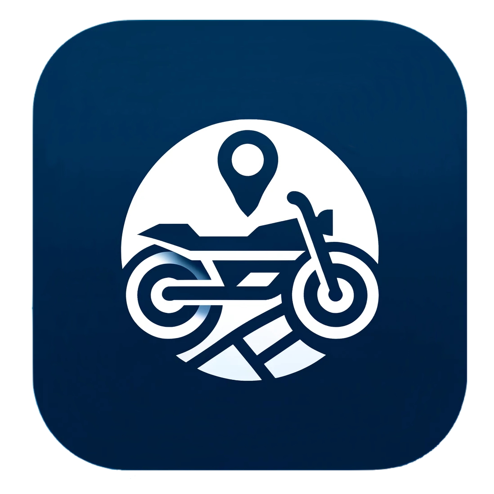
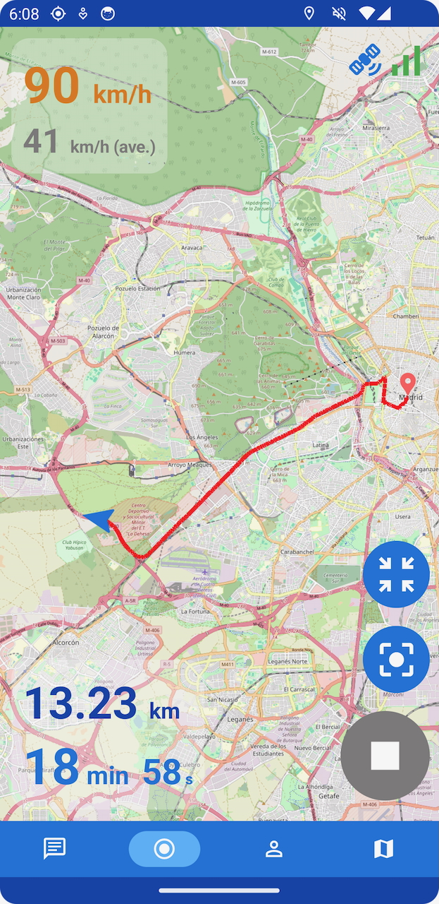
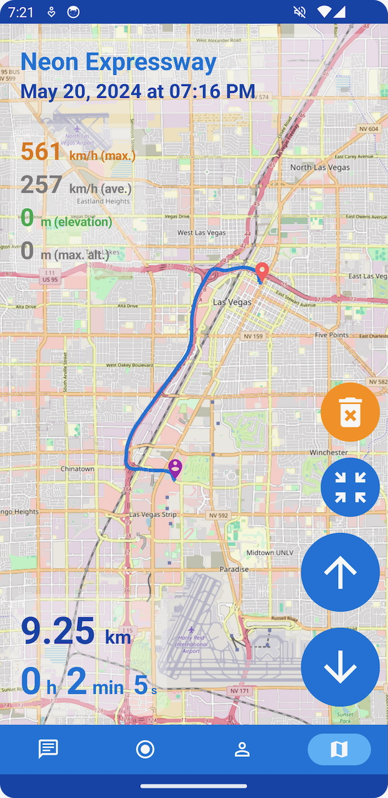
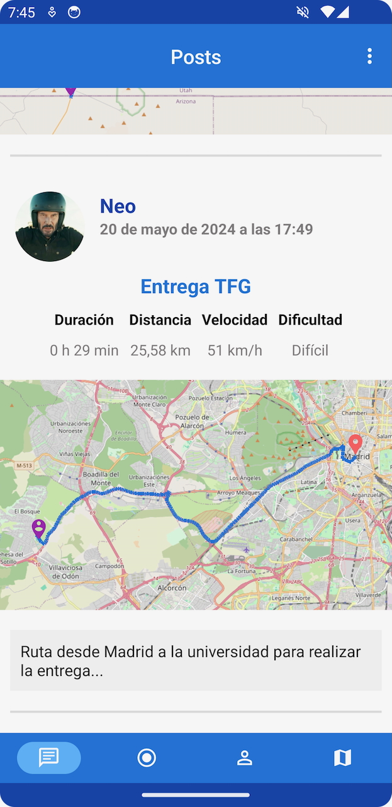
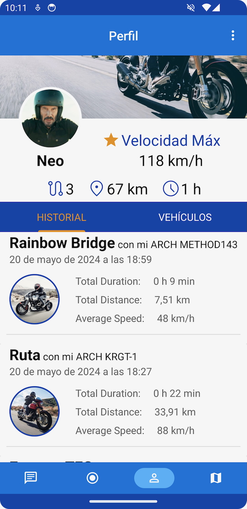
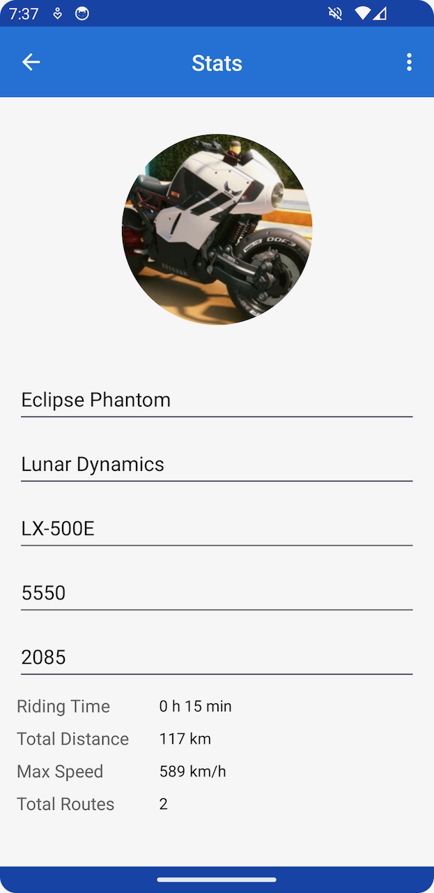
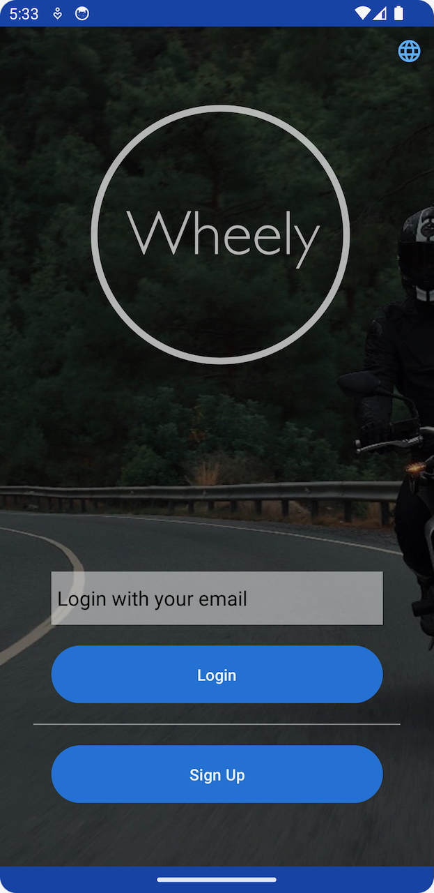

  

# Wheely: MotoRouteTracker-DAMFinalProject

Wheely is an Android app built for motorcyclists, providing tools to record, browse, and manage motorcycle routes. Developed as the final project in the **Técnico Superior en Desarrollo de Aplicaciones Multiplataforma (DAM)** program, Wheely focuses on accurately capturing and storing telemetry data, allowing users to create a detailed log of their riding experiences. The project was a collaborative effort with [Terciodecuplo](https://github.com/Terciodecuplo).

## Showcase

### Screenshots: Emulator

    

        Track Recording 
        
    

    

        Track Viewer 
        
    

    

        Feed 
        
    

    

        Profile 
        
    

    

        Vehicle Stats 
        
    

    

        Login 
        
    

### GIF Demos: Test Device

    

        Starting tracking 
        
    

    

        Foreground service & UI restore 
        
    

    

        Live tracking interactions 
        
    

    

        Stopping and saving 
        
    

    

        Browsing saved tracks 
        
    

    

        General UI & localization 
        
    

## Features

- **Real-time Route Tracking:** Capture routes with precise telemetry (speed, duration, GPS).
- **Route History:** Review and analyze previously recorded routes with detailed stats.
- **Track Analysis:** Analyze routes with metrics like speed, time, distance, and elevation.
- **User Profile Management:** Manage profiles and track history within the app.
- **Vehicle Management:** Add, edit, and delete vehicles linked to routes.
- **Intuitive Interface:** Responsive UI with dynamic elements.
- **Permissions Management:** Comprehensive handling of Android permissions.

## Technologies Used

Kotlin, Android Studio, MVVM Architecture, Room DB, OSMDroid (with OpenStreetMaps API)

## My Contributions

I developed the entire **backend and frontend for GPS tracking** in Wheely, including the service, data layers, and UI for route tracking and viewing, along with all supporting classes.

- Built the **live GPS tracking system** using a **foreground service** [`TrackingService.kt`](app/src/main/java/com/jmblfma/wheely/services/TrackingService.kt) for real-time data collection.
  
- **Managed the complete data flow** for track-related functionality, from capturing live data to processing and exposing it in the UI through [`TrackDataRepository.kt`](app/src/main/java/com/jmblfma/wheely/repository/TrackDataRepository.kt), [`TrackRecordingViewModel.kt`](app/src/main/java/com/jmblfma/wheely/viewmodels/TrackRecordingViewModel.kt), and [`TrackViewerViewModel.kt`](app/src/main/java/com/jmblfma/wheely/viewmodels/TrackViewerViewModel.kt) within the MVVM architecture.
  - Integrated Room database for reliable data persistence with [`TrackDao.kt`](app/src/main/java/com/jmblfma/wheely/data/TrackDao.kt), [`AppDatabase.kt`](app/src/main/java/com/jmblfma/wheely/data/AppDatabase.kt), and [`DatabaseBuilder.kt`](app/src/main/java/com/jmblfma/wheely/data/DatabaseBuilder.kt).
  - Designed custom data structures for telemetry data: [`Track.kt`](app/src/main/java/com/jmblfma/wheely/model/Track.kt), [`TrackPoint.kt`](app/src/main/java/com/jmblfma/wheely/model/TrackPoint.kt).

- **Developed the UI for track recording and viewing**, including [`TrackRecordingActivity.kt`](app/src/main/java/com/jmblfma/wheely/TrackRecordingActivity.kt), [`TrackViewerActivity.kt`](app/src/main/java/com/jmblfma/wheely/TrackViewerActivity.kt), and associated layouts.
  - Refactored map operations into [`MapUtils.kt`](app/src/main/java/com/jmblfma/wheely/utils/MapUtils.kt) for better code management (see below).
  - Built robust logic to ensure the Track Recording and Viewer screens could restore their state after interruptions, independent of user actions or phone events.
  - Integrated dynamic UI elements like GPS signal indicators and live map previews.
  - **Developed the feed’s post map previews** and associated database fetching logic with [`PostsAdapter.kt`](app/src/main/java/com/jmblfma/wheely/adapter/PostsAdapter.kt) and `setupFeedObservers()` in [`HomePageActivity.kt`](app/src/main/java/com/jmblfma/wheely/HomePageActivity.kt).

- **Mapping and Visualization** through the [`MapUtils.kt`](app/src/main/java/com/jmblfma/wheely/utils/MapUtils.kt) class, which **integrates OSMDroid and OpenStreetMaps APIs**.      This class handles dynamic map configurations, such as zoom levels, route rendering, and marker placement. 
   - Includes custom logic for live route updates, accuracy circles, and route previews. 
   - Manages the aesthetic aspects of the map, ensuring clear and visually appealing route displays, including color-coding routes based on their state (active, loaded, pending save). 
   - Supports features like auto-centering, animation, and bounding box adjustments to optimize the user experience during track recording and viewing.

- **Implemented comprehensive track analysis** in [`TrackAnalysis.kt`](app/src/main/java/com/jmblfma/wheely/utils/TrackAnalysis.kt), calculating key metrics such as speed, duration, distance, and elevation. These metrics are essential for both UI display and track data storage.
  - Developed methods for single-track and batch-track analysis, including average speed, total distance, and maximum altitude.
  - Integrated date and time formatting with localization, ensuring consistent and localized presentation of data across the app.

## Collaborator Contributions

This project was developed in collaboration with [Terciodecuplo](https://github.com/Terciodecuplo), who contributed to:

-  **User Interface Design:** Developed the navigation bar, login screen, toolbar, and user profile screens.
-  **Vehicle Management:** Implemented vehicle data management, including persistence, editing, deletion, and integration with user profiles.
-  **Database Integration:** Integrated users and vehicles into the Room database.
- **Image and Media Handling:** Added support for profile pictures, banners, and vehicle-related media.
- **Localization:** Managed localization for multiple languages.
